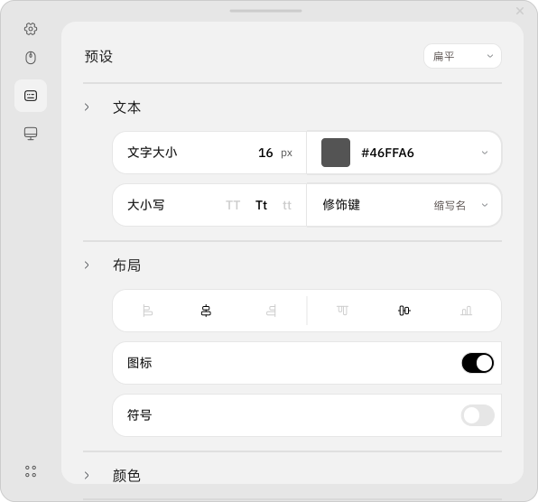

Keyviz 是一款免费开源的按键可视化软件，可以实时显示您的按键和鼠标操作！<br>
无论是在录屏、演讲还是团队协作中，您都能让观众一目了然地看到操作过程。

这里是 Keyviz 的社区汉化版，原版请访问 [mulaRahul/keyviz](https://github.com/mulaRahul/keyviz)。<br>
This is the community Chinese localized version of Keyviz, please visit [mulaRahul/keyviz](https://github.com/mulaRahul/keyviz).

# 🖱️ 键鼠搭配

新版本可以显示鼠标操作啦！除了点击之外，您还能展示键鼠配合的操作，例如 <kbd>Cmd</kbd> + <kbd>Click</kbd>、<kbd>Alt</kbd> + <kbd>Drag</kbd> 等。


# 🎨 个性定制

告别单调的黑白！您可以随意调整可视化效果的样式，包括风格、大小、颜色（普通键与修饰键）、边框、图标等。



功能强大且简单易用：

- 可以忽略打字输入，只显示 <kbd>Cmd</kbd> + <kbd>K</kbd> 之类的快捷键 **（默认）**
- 自由选择将按键显示在屏幕上哪个位置
- 可以设定按键显示的停留时间
- 有多种入场、出场动画可选

</br>

# 📥 安装

前往 [**Github 发行版**](https://github.com/zetaloop/keyviz/releases) 页面下载最新汉化版，进行安装或直接解压即可使用。

以下是各平台的更多安装渠道与使用要求：

<details>

  <summary>🪟 Windows</summary>

  ### 👜 微软商店（英文原版）
  您可以从 [微软商店](https://apps.microsoft.com/detail/Keyviz/9phzpj643p7l?mode=direct) 下载到英文原版的 Keyviz。

  ### 🥄 Scoop（英文原版）
   ```bash
  scoop bucket add extras # 先添加软件源
  scoop install keyviz
  ```

  ### 📦 Winget（英文原版）
  ```bash
  winget install mulaRahul.Keyviz
  ```

  </br>

  <details>
  <summary>遇到了 <code>*.dll</code> 缺失报错？</summary>

  如果在打开软件后出现 `.dll` 文件缺失的错误，这是因为你没安装 Visual C++ 运行库。[点击打开微软 VSC++ 运行库下载页面](https://learn.microsoft.com/zh-cn/cpp/windows/latest-supported-vc-redist?view=msvc-170)。

  </details>

</details>

</br>

<details>

  <summary>🍎 MacOS</summary>

  ### 🔒 权限
  
  Keyviz 需要 **输入监视** 和 **辅助功能** 权限，请在设置中允许。
  </br>
  ```
  系统设置 > 隐私与安全性 > 输入监视/辅助功能
  ```

  </br>

</details>

</br>

<details>

  <summary>🐧 Linux</summary>

  ### ❗ v2.x.x 要求
   ```bash
  sudo apt-get install libayatana-appindicator3-dev
  ```
  或
  ```bash
  sudo apt-get install appindicator3-0.1 libappindicator3-dev
  ```

  </br>

</details>


</br>

# 🛠️ 构建指南

如果想要进一步开发或自己编译这个项目，那请便吧。首先请确保您已安装 Flutter。如果还没，参考 [这个指南](https://docs.flutter.cn/get-started/install)。

安装好 Flutter 后，如果有 `git` 请克隆项目仓库，或者直接下载 zip 解压也行。

```bash
mkdir keyviz
cd keyviz
git clone https://github.com/zetaloop/keyviz.git .
```

现在已经进入 Flutter 项目，运行构建命令即可构建可执行文件。

```bash
flutter build windows
```

此外，汉化作者 zetaloop 隆重宣布——我完成了一个 [GitHub 工作流](https://github.com/zetaloop/keyviz/blob/main/.github/workflows/build.yml) 可以自动编译所有平台的 Keyviz，若有需要请自取～

</br>

# 💖 支持

Keyviz 完全免费，依靠您的慷慨捐助来支持开发。您的支持能让我投入更多时间和精力完善这款软件。

赞助原作者：<kbd>[GitHub Sponsors](https://github.com/sponsors/mulaRahul)</kbd> <kbd>[Open Collective](https://opencollective.com/keyviz)</kbd>
